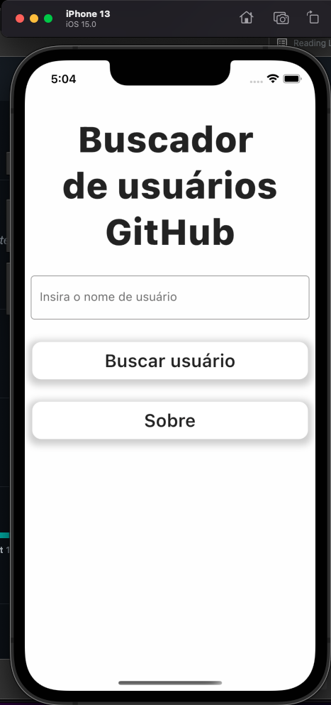

# GitHubSearchingFlutter

## Our Goal
The goal is to build an application using flutter to search for GitHub's user data. The project must use MVC Pattern, state management and run on IOS and Android.

## What we've created
By the end of the project, we got a flutter application that can look for users on github and list their info.

## What we've done
* Search on Github API
* User input validation
* Project uses MVC
* Project uses GetX for state management
* Dio Error Handling

  
  
  

